### Youtube Uploader Explain

---

1. First of All, You will go Open telegram Bot through : [Youtube Uploader](https://telegram.dog/utube_pipeline_bot)

2. Start the Bot:
 

    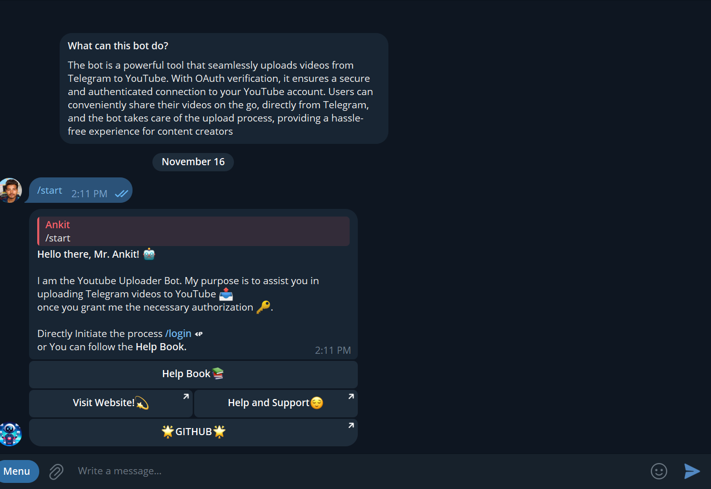
 

3. We can understand about the bot through the **Help Book**.
 

  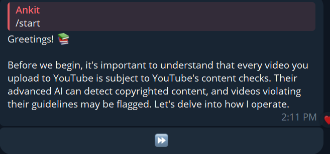
  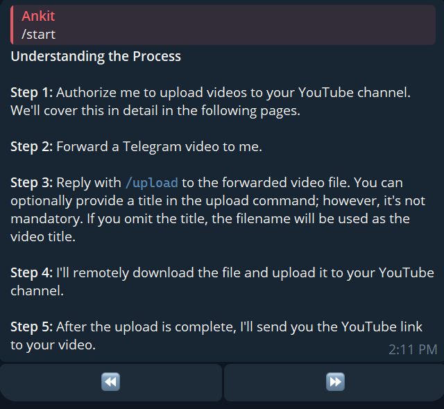
  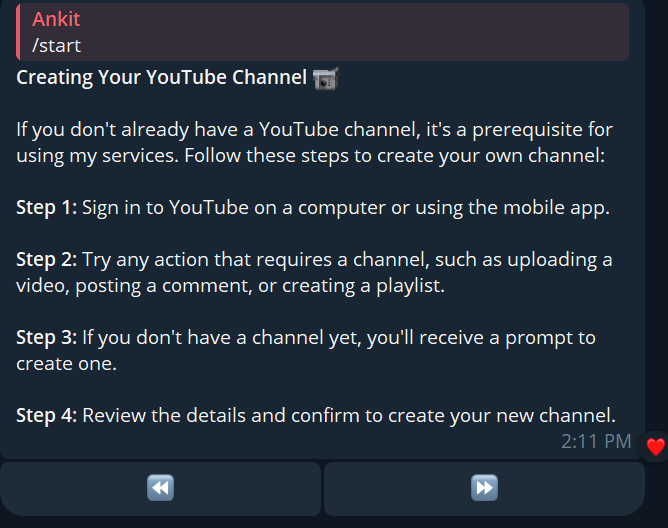
  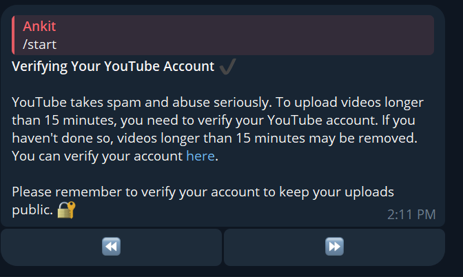

 

4.  Click on “**SIGN UP WITH GOOGLE**” it will redirect you on Browser.

  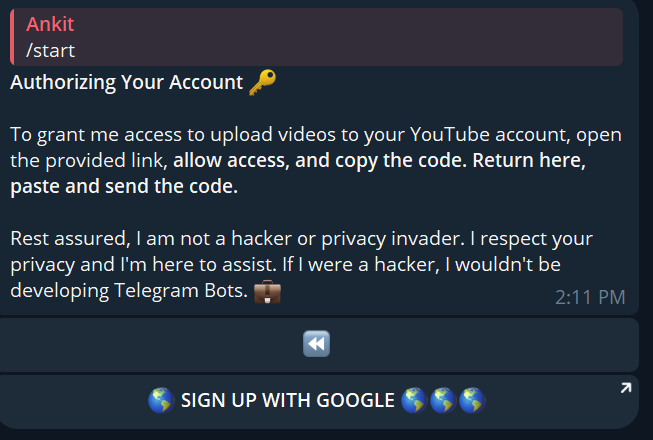

5.  Choose Your Account in which you want to upload youtube Videos.
    
Click on Your Youtube Verified account

    

       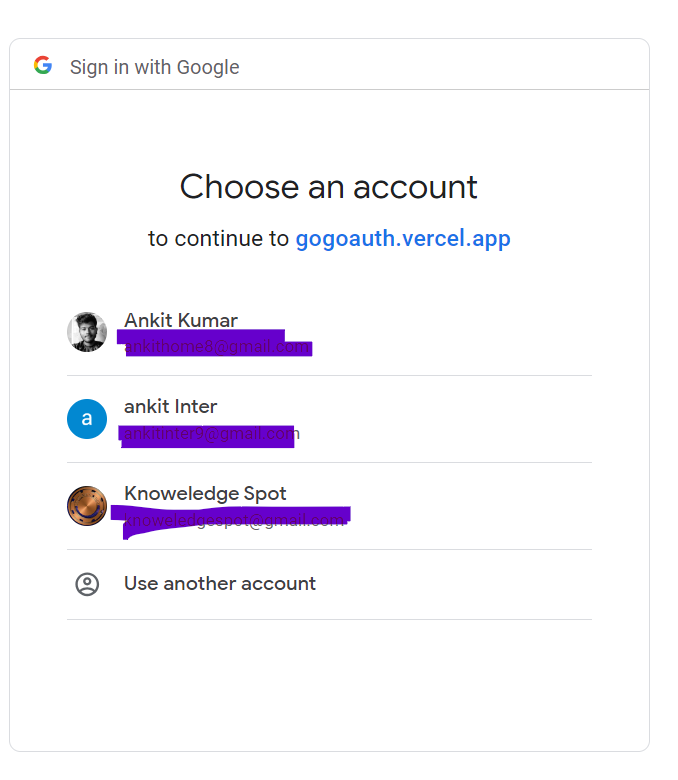
    

    <strong></strong>
    
Click on Continue

    

        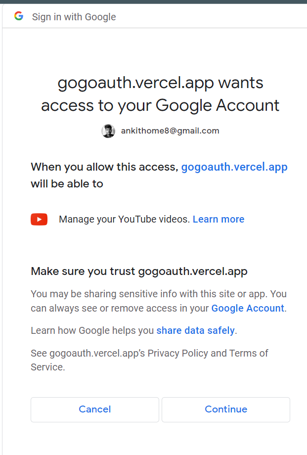
        

 
COPY Auth Code and Close the browser

 

     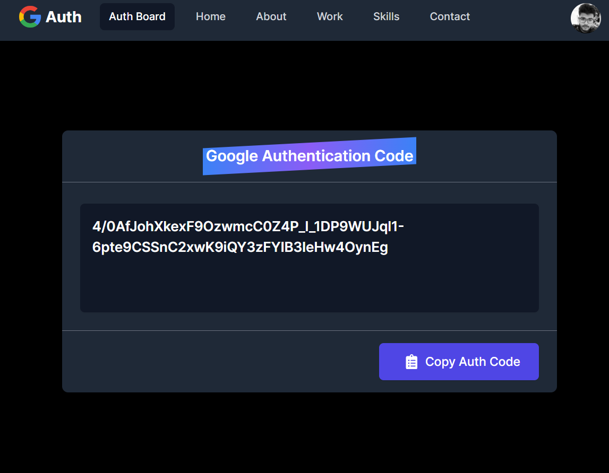
     

6. Send the auth code to the telegram bot:

 
Paste the code.

     
     

_Viola! You are Verfied. Now, You can Upload the Video on Your Account which is saved on Your telegram cloud._

---

### Bot Functions:

1. Upload the Video through `/upload video_name`
  
You will get the screen

 

      
      

  
Upload complete screen

 

      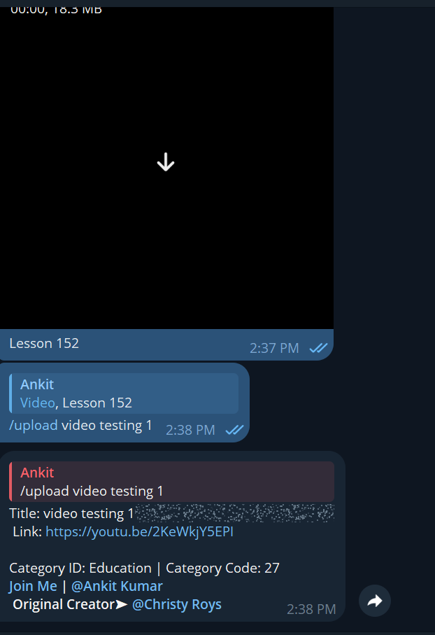
      

2. When Your Finished Your Task You can logout with `/logout` command.
   
`/logout` command execution example

 

       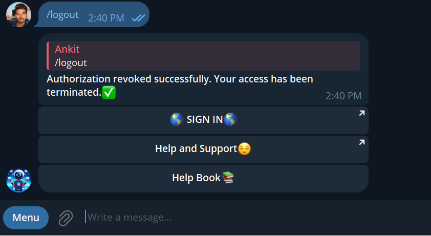
       

