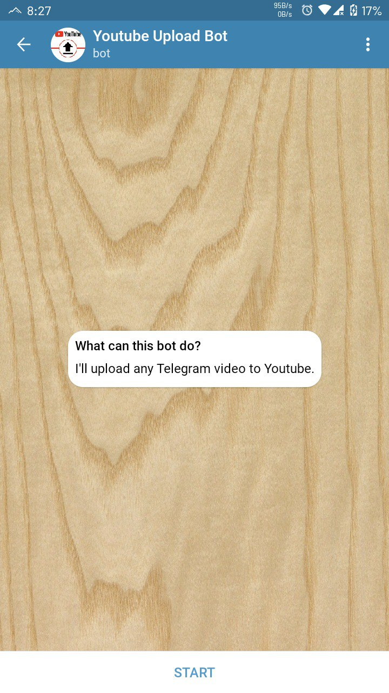
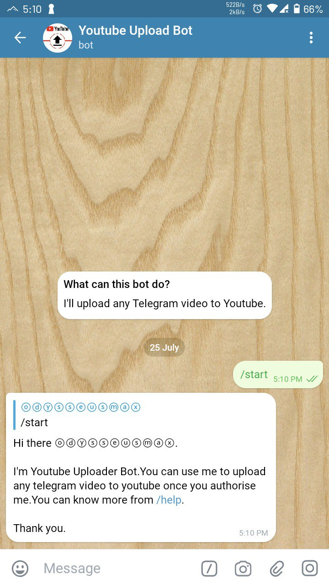
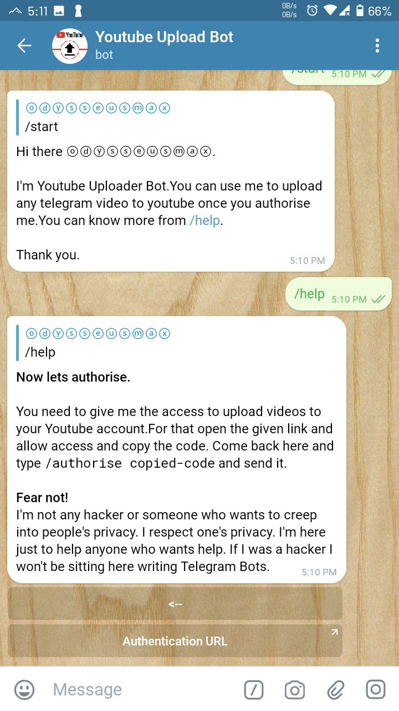
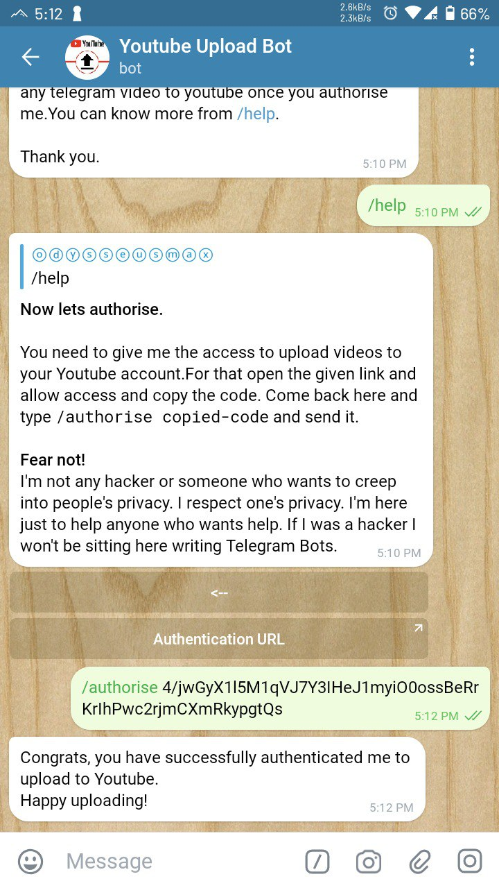

# [Youtube Uploader Bot](https://t.me/youtubeitbot)

> Simple [Telegram Bot](https://core.telegram.org/bots "Telegram Bots") to Upload videos to [Youtube](https://youtube.com "Youtube") written in Python3.


### Contents

* [Info](#info)
* [Libraries Used](#libraries-used)
* [Setup](#setup)
* [Status](#status)
* [Special Notes](#special-notes)
* [Screenshots](#screenshots)
* [Video Tutorial](#video-tutorial)
* [Contact](#contact)
* [License](#license)

### Info

This is a simple hobby project which I was really curious about to implement. This is a Telegram bot which uses [Youtube Data API v3](https://developers.google.com/youtube/v3/ "Youtube Data API v3") to upload videos to Youtube.

### Libraries Used

* [Pyrogram](https://github.com/pyrogram/pyrogram "Pyrogram")
* [Google Client API](https://github.com/googleapis/google-api-python-client "Google Client API")

### Setup

:heavy_exclamation_mark: This project requires Python3.6 or higher

**Clone and setup virtual environment**

``` bash
$ git clone https://github.com/odysseusmax/utube.git

$ cd utube

$ virtualenv venv

$ source venv/bin/activate

```

**Environment Variables**

* `BOT_TOKEN`(Required) - Get your bot token from [Bot Father](https://tx.me/BotFather "Bot Father").
* `SESSION_NAME`(optional) - Your bot's username.
* `API_ID`(Required) - Your telegram api id, get from [Manage Apps](https://my.telegram.org).
* `API_HASH`(Required) - Your telegram api hash, get from [Manage Apps](https://my.telegram.org).
* `CLIENT_ID`(Required) - Your google client id.
* `CLIENT_SECRET`(Required) - Your google client secret.
* `BOT_OWNER`(Required) - Telegram id of bot owner.
* `AUTH_USERS`(optional) - Telegram id's of authorised users, separated by `,`.

**Getting your `CLIENT_ID` and `CLIENT_SECRET`**

* Head to [Google console](https://console.developers.google.com "Google console"), create a new project named `Youtube Uploader` and enable `API'S AND SERVISES`. Search for `YOUTUBE DATA API v3` and enable the API. Go to [Credentials](https://console.developers.google.com/apis/credentials "Credentials") page, select your project `Youtube Uploader` create a new credential with `other` as type. Copy the `CLIENT_ID` and `CLIENT_SECRET` and paste them to `config.py`

**Install requirements**
Run :
```bash
$ pip3 install -r requirements.txt
```

**Run bot**

Lets run our bot for the first time!
```bash
$ python3 -m bot
```
If you did everything correctly, the bot should be running. Go do `/start` to see if the bot is live or not. Follow the instructions provided by bot to setup authorisation and to start uploading.


**Or the easy way of directly deploying to heroku**

[](https://heroku.com/deploy?template=https://github.com/odysseusmax/utube/tree/master)


### Status

This project is actively maintained and will continue so until I'm tired of it.

### Special notes

* With the Youtube Data API you are awarded with 10,000 points of requests. For one video upload it costs 1605 points, regardless of file size, which calculates to about 6 uploads daily. Once you have exhausted your daily points, you have to wait till daily reset. Resets happens at 0:00 PST, i.e. 12:30 IST. So make your uploads count.

* Uploading copyright contents will leads to immediate blocking of the video, and will not be added to your `MyVideos` section of youtube. But still the video can be played directly through the link provided by the bot.

* All the videos are uploaded as private. You may change it after youtube processes the video.

### Screenshots
<p align="center">










</p>

### Video Tutorial

Here's a YouTube tutorial video for deploying the bot on [Heroku](https://heroku.com/ "Heroku"). [Video Link](http://www.youtube.com/watch?v=LSs8b5dMWIA "Tutorial video for deploying to Heroku").

### Contact

You can contact me [@odysseusmax](https://telegram.dog/odysseusmax "odysseusmax").

### License
Code released under [GNU General Public License v3.0](LICENSE).
